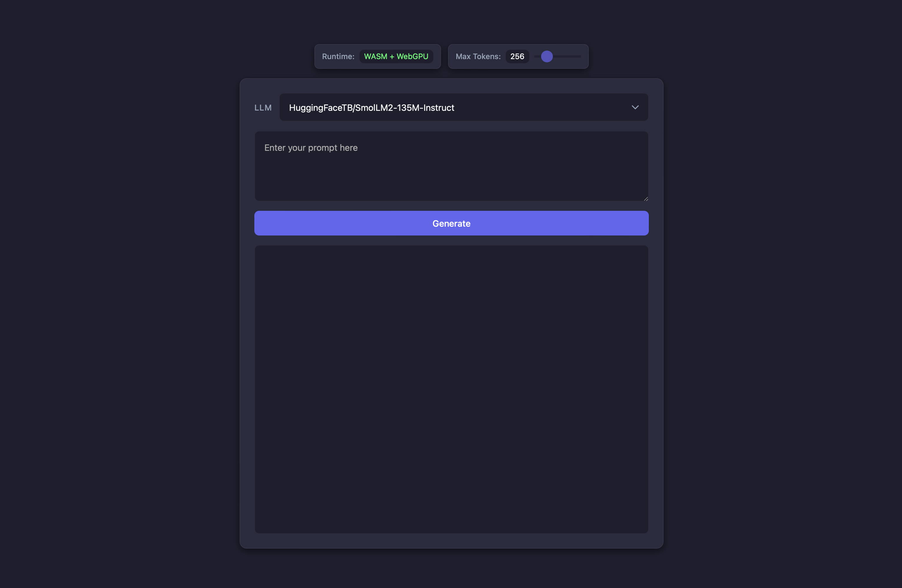

# browser-llm

Run large language models entirely in the web browser 🚀

Utilizes [transformers.js](https://github.com/xenova/transformers.js) to implement transformer-based language models in JavaScript and [onnxruntime-web](https://github.com/microsoft/onnxruntime) to efficiently run these models in the browser via [WebAssembly](https://webassembly.org/) (and soon [webGPU](https://github.com/gpuweb/gpuweb)).

(Note: TinyLlama-1.1B-Chat-v1.0 issue will be resolved in the upcoming v3 release of transformers.js)

https://wllbo.github.io/browser-llm/

